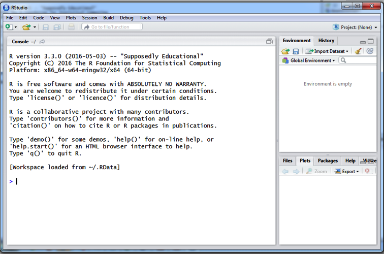
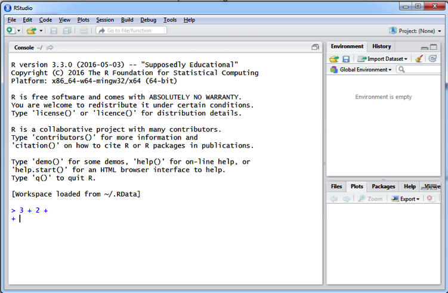
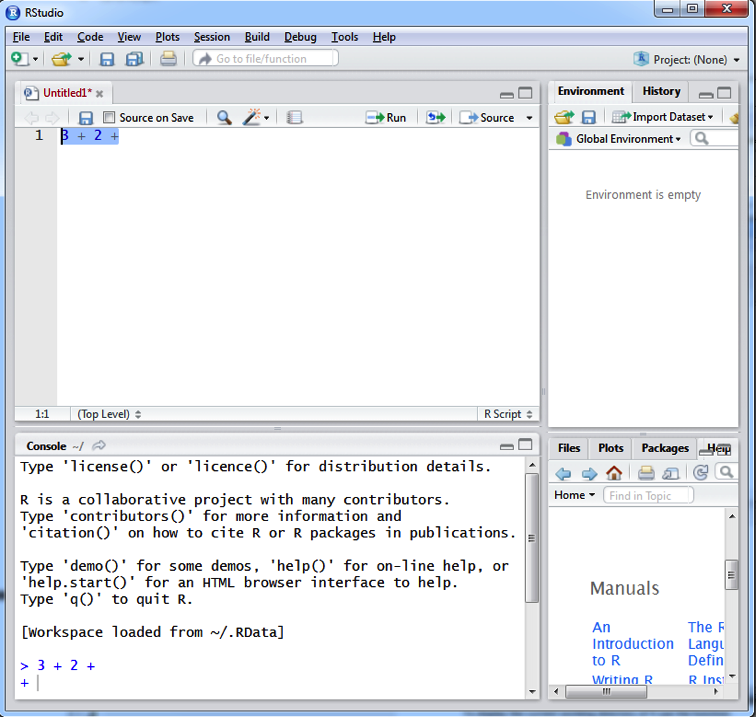

```{r setup, include = FALSE}
knitr::opts_chunk$set(echo = TRUE)
```

# Introduction to R
## A Short history of R
R is a statistical software largely based on the S language. S was created in the 1970s but only started becoming popular in the late 1980s when its programming core was translated into C (from FORTRAN). It was later commercialized through the S-Plus software, a quite popular statistical tool throughout the early 2000s. During the 1990s, R was introduced as an open source S-based alternative, with capabilities similar to S-Plus, but with a more simplistic Graphical User Interface (GUI). In parallel with the rise of S-Plus, R also received significant attention, particularly through its application in university research. As the "younger (and free) sibling" of S-Plus, R has become the main statistical programming tool for a growing number of statisticians. The contributor structure of R, where the functionality of the platform is continuously increasing through an expanding set of freely-available, user-contributed packages, makes R more and more popular and powerful over time. To date, more than two thousand packages have been contributed to the R archive (CRAN) mirror.

Nowadays, R is almost entirely based on scientific contributions of users in the form of packages. There is a Core group dealing with the development of the project and the GUI, but most of the functions are provided by external scientists. R is provided under a GNU general public license, which allows it to be used freely by anyone for any purpose, but provides no warranty or guarantees on its functionality. The software's interface is not the most welcoming to users not familiar with programming and script language; there is thus a steep learning curve for the beginner in R. R is more user-friendly than classical programming languages (such as C) and can have a similar user-interface to programming software platforms like MATLAB (especially when using the RStudio interface). As a programming language, however, R requires more programming expertise than GUI-based statistical software, such as Excel, SPSS or TreeAge. Despite the learning curve, we feel that the convenient combination of programming capabilities, the level of control over the statistical methods used, the availability of open-source solutions, online help and publicly available scientific literature on the use of R far outweigh the lack of a (not so) user-friendly GUI.

## How to install R
R is freely distributed through the website of the Comprehensive R archive Network (CRAN) (<http://www.r-project.org>). Just select the mirror situated on a location close to you, download and install the R version that suits your operating system (OS).The base version of R is what you need so that you can start interacting with it (extending this base version by downloading additional packages will be discussed later). You should generally install the most recent version of R.

## Add-on R GUIs and install R Studio
Over the last years a number of add-on GUIs have been developed that simplify considerably the use of R by providing structure and guidance on writing code in R. While not eliminating the need to write code, these GUIs offer more point-and-click options thereby making the transition to R easier. Although numerous such interfaces exist, RStudio is the most popular of these and is the one we will be using throughout this handbook. It can be downloaded and installed for free from <https://www.rstudio.com/>. 

* Choose "Download" underneath the RStudio image on the home page.
* On the next page, choose "Download" under "R Studio Desktop Open Source".
* Pick the installer for your operating system and run the installer as usual.

Some of the functions in Rstudio that improve efficiency include the auto-filling option with the use of the 'Tab' button; the automatic closing of brackets, parentheses, and braces; the color-coding of code semantics (e.g., different colors for a numeric variable vs. a string variable vs. a comment); and the automatic identification of errors (e.g. missing closing bracket).

## Playing around with the RStudio interface
After installing both R and RStudio, open the RStudio interface. Figure 1 previews what will appear on your screen.

```{r, echo = F, fig.cap = "The RStudio interface", out.width='100%'}

```


The R Console is the area where all commands are executed. The sidebar on the bottom right provides easy access to any plots generated by R, an overview of the files in the working folder, the packages available and a help interface. On the top right, the sidebar offers easy access to the variables that are currently in R's memory (the list is empty in Figure 1). The menus on top of the Console offer access to the basic actions (Open script, Save script, Copy, Paste, Undo, Stop script, Print) and specific R functions (e.g. loading R packages). The `>` sign on the console, on the left side of the cursor, designates that R is ready and waiting for a command. In Figure 2, the `+` sign indicates that R expects the user to provide the rest of an incomplete command. Clicking the button 'Stop' or pressing the keyboard button 'Esc' terminates the current command and returns R to the ready and waiting model `>`.

```{r, echo = F, fig.cap = "The busy ‘+’ sign in the R Console", out.width='100%'}

```


Although all commands are passed to R through the Console, it is more convenient for the user to keep a record of the commands typed in a Script where the process of the analysis will be documented. To create a new script click on the 'File' menu and select "New File" and subsequently 'R Script'. A new script window will open within RStudio, very similar to a notepad (Figure 3). Save this script (i.e., menu File -> Save as) and go on using it as a Script editor to document your research steps. Once you have typed your command in the Script Editor, there are multiple ways of executing this command in the R Console. The most laborious would be to copy and paste each command from the Script Editor into the Console. Instead, however, you can execute a command written in the Script Editor in (at least) three time-saving ways: 
Select the piece of script that you want to run and

1. Click the button 'Run' on the top of the Script Editor 
2. Press 'Ctrl+R' or 'Ctrl + Enter' if using Windows OS, or 'Cmnd + Enter' if using Mac OS 
3. Drop down the menu 'Code' and select 'Run line(s)'

R and RStudio each have very comprehensive and useful 'Help' menus. By clicking on the R Help button in the Help menu a table of contents shows up at the bottom right of the RStudio interface. Except from a number of FAQs, the section in the help menu named 'Manuals' includes documents that offer a detailed introduction to R and its basic applications. RStudio has its own documentation (Help -> RStudio Docs) and Support (Help -> RStudio Support).

```{r Rstudio_Editor_ConsoleWin, echo = F, fig.cap= "Writing and transferring commands from the script Editor to the Console", out.width='100%'}

```


## Setting a working directory

One of the first things you'll have to do when working with R is to set a working directory. This will be the directory (or folder) from where all data will be imported and all output and scripts will be stored. To display the **current** working directory of R use the function

```{r, eval = FALSE}
getwd()
```

To **change** the working directory either go to the 'Session' menu, select the 'Set working directory' -> 'choose directory' option and set your working directory or, easier, write the command

```{r, eval = FALSE}
setwd("path of your working directory"(e.g. "C:/")) 
```

on the top of your script. Remember that when setting the path you should use a forward slash. Also, a general rule in R is that text variables (known as a "strings") need to be in single or double quotes, so that R will differentiate between a variable name and a string of text. 

An alternative, handy approach you can take in setting the working directory is to ask R to set the working directory always to the one that you have loaded the file from. This can be done in two ways: you can either select 'Session -> Set Working Directory -> To Source File Location'  through the drop-down menu or you can add this code on the top of your script:
```{r, eval = FALSE}
setwd("path of your working directory"(e.g. "C:/")) 
```


## Cleaning the working space and the R memory

It is advisable to begin one's script with a command that wipes any R related functions or variables from the computer memory. Cleaning up the memory before running a script is advisable so that you avoid errors caused by leftover variables.

This command is `rm(list = ls())`, which means: First, make a list with all the variables and functions loaded in the workspace: `list = ls()`. Then, remove every component of this list using the `rm()` function. Alternatively, selecting ctrl + l on your keyboard, on both Mac and Windows platforms, cleans the R Console from all previous functions. 

## Adding explanatory comments 

Good practice in any programming language requires that code is written clearly, using logical steps and with sufficient documentation. The latter is very important for reproducibility and reviewing purposes. In R, documentation is possible through the use of explanatory comments. Text that represents a comment is indicated using the hashtag (#) symbol before the comment. For example, running the lines below

```{r, eval = FALSE}
# cleaning the memory of R
rm(list = ls ()) 
```

will execute the command to clean the R memory but will skip the first line because of the hashtag symbol. It is important to note that comments can also be added in the same line but after the expression the comment is referring to. For example:

```{r, eval = FALSE}
rm(list = ls ()) # cleaning the memory of R
```

This commenting approach reduces the lines of code and results in more condensed code. It is generally advisable to be used if the comments are short.

## Installing R Packages

R is designed in such a way that the user can expand its capabilities through the inclusion of add-on *packages*. These packages (also known as libraries) are collections of functions, data, and externally compiled programmes, which are combined together in order to address some statistical issue.

The vast majority of packages are provided by external researchers and are stored in CRAN mirrors worldwide. You can expand your installation of R to include a given package through the menu 'Tools' -> 'Install packages'. Through this menu you can i) select your preferred CRAN repository and mirror, ii) download and install the selected package or iii) install a package manually through a compressed file. Alternatively, R packages can be installed by running the command `install.packages("foopackage")` where `"foopackage"` corresponds to the name of the package you want to install. Packages will always include documentation regarding the use of the included functions. Sometimes they will also have a 'vignette' PDF file where detailed examples and theoretical background is provided.

You can also install a package by first downloading it in a .zip format from the web and then manually installing it through the `Tools` -> `Install packages` menu and selecting the .zip file. Finally, R users have recently started providing R scripts and functions through the Github service. Although this is beyond of the scope of this introduction, RStudio is capable of loading scripts and functions directly from Github (interested readers should see <http://www.r-bloggers.com/rstudio-and-github/> for further details)

## Loading R packages

After you have installed an R package, you have to load its library in R. This is done by typing `library(foopackage)`, where `foopackage` is the package you are interested in loading. Note: here the name of the package is a variable name and not a string, therefore there is no need for quotes around the name. Often packages will depend on other packages in order for their functions to work. In that case, some packages might be automatically loaded. Pay attention in case any of these packages include functions with the same name as any of the functions already loaded or created. Loading these packages will result in existing functions being overwritten by the new functions of the same name. Remember that you can access the help file for any package using the `help(package = "foopackage")` function.

In case you update your R version, it is likely that packages will be either need to be reinstalled or updated to be compatible with the newest R version. To ensure that packages are up-to-date, use the function `update.packages()`. 

Similarly you could use a function to update the whole R base version rather than just the packages. By using the `updateR()` command in the `installr` package you could update R to its most recent, stable version:

```{r, eval = FALSE}
install.packages("installr")
library(installr)
updateR()
```

Note that you need to have writing permissions in the folder that R is installed for any packages to be installed or updated. If you do not have writing permission in the base R installation folder (e.g., you are using a shared computer or server), you will need to specify a different folder into which packages will be installed. Below we provide some examples of how to install and call packages from a user-defined folder. 

If you have internet access to CRAN and would like to install the package to the working directory: 

```{r, eval = FALSE}
wd.names <- setwd("mywd")
install.packages("abind", repos = "http://cran.r-project.org", lib = wd.names)
install.packages("Matrix", repos = "http://cran.r-project.org", lib = wd.names)
```

In the example above we specify three arguments: the package name (e.g. `abind`), the repository (`repos`), which is the mirror where you can download the packages of interest, and the destination folder (`lib`). In this example, the destination folder is the working directory, `wd.names`. 

If you do not have internet access to CRAN on your laptop, you could download either the source or binary file of certain packages from CRAN and store the file in a user-defined working folder or library folder. A source file is a compressed package that contains the code and the structure of the package from the distributor. After you download the source files, you have to decompress the files and install the packages. 

```{r, eval = FALSE}
install.packages(paste0(wd.names, "/abind_1.4-5.tar"), repos = NULL, type = "source", 
                 lib = wd.names)
install.packages(paste0(wd.names, "/Matrix_1.2-7.1.tar"), repos = NULL, type = "source", 
                 lib = wd.names)
```

Because we install the package from the source packages in the local folder, we have to specify `repos = NULL`, and `type = source`. 

After we install the packages to the user-defined folder, we need to load the package from the user-defined folder as well. 

```{r, eval = FALSE}
library(abind, lib.loc = wd.names)
library(Matrix, lib.loc = wd.names)
```

If the directory of the library is user-defined, we have to specify `lib.loc = wd.names`. In addition to specify the directory of library every time in the library function, we can set up the library path using `.libPaths(wd.names)` before using the library function. 

## Getting help with R

Due to the open source nature of R, there is no official user manual that includes all available options for conducting a specific analysis. There is however a large number of information and advice on R topics within different forums and mailing lists, user-made manuals and package help files. There are different ways of reaching to an answer for your question, depending on the type of the question and how common it is:

* *Google*: The first place to search when you know what statistical approach you want to follow but do not know how it is done in R. Just type the method and the letter "R" next to it. Chances are that you will already find your answer this way.
* *RSeek*: A search engine for R FAQ functions and troubleshooting. RSeek uses Google to trace links that refer to the search terms provided. Together with Google, it is the best way to find which package/function you should use when you only have a hint about what you need to do.
* `RSiteSearch()`: Accessible directly through R, by typing `RSiteSearch("foo")` where foo should be replaced with the key term (e.g. `RSiteSearch("mean")`). This help function searches within forums, web discussions and mailing lists archived in CRAN for the keywords listed between the round brackets (in quotes). It is handy since it is accessed through the R Console but the key terms have to be rather well defined to reach to a topic related discussion.
* `help.search()`: Another function that is directly accessible from within the R Console. It performs a search within the help functions of the downloaded and installed packages for the provided key terms. Even less handy than RSiteSearch. 
* `?` or `help()`: Running a command with the name of a function and a question mark behind yields the help file for the function of interest. Very useful when you try to figure out how an exact function works. If you need information on a specific package rather than a function, the argument `package = "the name of the package"` should be included within the round brackets of the `help()` function (e.g., `help(package = "survival")
* User manuals and vignettes: If you need a proper example or you lack statistical background in the theoretical part of a function, it is a good idea to read the user manual of the package or, ideally, the vignette, if available. You can access the vignette using the function `vignette("the name of the package")`. Note, however, that not every R package comes with a vignette.


## Citing R

Using R in your work will possibly require you to reference R in your manuscript. To find out the appropriate reference for R just run the command `citation()` in the R Console. Depending on the version of R you are using this will result to a citation similar to this:

```{r, echo = FALSE}
citation()
```

# Mathematics and Statistics

The level of mathematical knowledge required from the beginner R user is significantly lower than in other computer languages like C or Fortran, given that a lot of the calculations are done in the background (sometimes R calls other programming languages in order to improve performance). However, there is some level of mathematical and statistical knowledge that the R user should be comfortable with in order to create and manipulate decision models in R. The following subsection will help you with the very basics of the mathematical prerequisites. 

## Simple calculations in R
R can be used as a simple calculator as well as a sophisticated tool for complex, computationally intensive mathematical applications. Mathematical operations (+, -, x, /) are performed in the regular order: multiplications or divisions first, additions subtractions after. Within the same operations there is no difference caused by the order of appearance within the command. For example:

```{r, eval = FALSE}
3 + 4 * 2 / 8
2 * 4 / 8 + 3
```

The use of parentheses however can change the order of calculations (as in regular algebra):

```{r, eval = FALSE}
((3 + 4) * 2) / 8
```

The value $y$ to the power of $x$ is symbolized by `y ^ x`:
```{r, eval = FALSE}
3 ^ 3 
```

Note that power operations precede all other mathematical operations (+, -, x, /) in the order of operations.

When first installed, R comes with most of the commonly used mathematical expressions built-in. The (natural) logarithm of x is calculated through the `log(x)` expression, the exponentiation $e^x$ is done through the `exp(x)` command and so on (Table 1). A comprehensive list of mathematical expressions and their representation with R language can be found in the R Reference Card (<http://cran.r-project.org/doc/contrib/Short-refcard.pdf>)


Function name               |  Function name
--------------------------- | -----------------------------
Natural Logarithm: `log()`  |  Square root: `sqrt()`
Exponent: `exp()`           |  Pi: `pi`
Minimum:  `min()`           |  Integer rounding : `round()`
Maximum:  `max()`	          |  Euler's number: `exp(1)`

Table 1 : Common functions in R

## Assigning values to variables

Estimation methods in R can vary in difficulty: From very trivial calculations to difficult statistical estimations that require plenty of pages of script and coding, references to external packages and functions, and possibly references to other R files as well. Once the calculations get more complex than a simple mathematical operation, assigning values to variables becomes handy. By 'assigning values to variables', we mean that a value, a mathematical operation, a dataset or a function will be assigned a name, which will be unique within the R session. You can assign a value to a name using the '=' operator or the combination '<-'. Both of them are equivalent, although the latter has been for historical reasons used more often in R. To be consistent with the Good Practices in R Programming (see Code style document) and to avoid confusion we will be using the '<-' sign as the operator to assign values to variables. 

## Single elements, vectors and matrices. 

A single element is any individual real numerical value. Any single element can be assigned on a variable in R. Try for example to create nine variables where each variable captures a value from 1 to 9:


```{r, eval = FALSE}
E1 <- 1
E2 <- 2
E3 <- 3
...
E9 <- 9
```

A set of $p$ single elements when combined together in a one-dimensional structure create a vector of length $p$. Vectors have their own characteristics (name, dimension) and properties (i.e. different multiplication rules). In R, a vector can be created by passing single elements to the `c()` function:

 
```{r, eval=FALSE}
Vec1 <- c(1, 2, 3) 
or
Vec1 <- c(E1, E2, E3)
```

`Vec2` and `Vec3` can be constructed accordingly.
```{r, eval=FALSE}
Vec2 <- c(4, 5, 6) 
Vec3 <- c(7, 8, 9)
```
$q$ vectors (of length $p$) grouped as columns next to each other construct a matrix of size $p \times q$. The dimensions of the matrix describe the number of rows ($p$) and the number of columns ($q$) of the matrix. A matrix in R is usually assigned its own name and, like vectors, has different properties in algebraic calculations. You can construct a matrix in R in various ways:

```{r, eval = FALSE}
Matr <- matrix(c(1, 2, 3, 4, 5, 6, 7, 8, 9), nrow = 3)

```
or

```{r, eval = FALSE}
Matr <- cbind(c(E1, E2, E3), c(E4, E5, E6), c(E7, E8, E9))

```
or

```{r, eval = FALSE}
Matr <- cbind(Vec1, Vec2, Vec3)

```
where `matrix()` is the command that forces R to organize this set of numbers in a matrix form with a user-defined row size (here 3). The command `cbind()` requests R to combine the vectors by columns in order to form a matrix. Similarly, the command `rbind()` combines the vectors by rows respectively.

While mathematical a vector can be considered as a matrix with either one row or one column and a single element can be considered as a matrix with just one element, in R such structures must be explicitly delcared to be a matrix in order to be properly handled by functions that take matrix inputs. The following shows how to explicitly implement a single element or vector as a matrix:

```{r, eval = FALSE}
E1 <- 1 # single element
M.E1 <- matrix (E1, nrow = 1) # 1x1 matrix of a single element

Vec1 <- c(E1, E2, E3) # vector of length 3
M.Vec1 <- matrix(Vec1, ncol = 1) # 3x1 matrix of a single vector

```


Multidimensional matrices can be constructed in R using the `array` function. The number of dimensions need to be provided as well as the elements of the array. The function `abind` (in package `abind`) allows the user to bind matrices or arrays to general higher dimension elements.For example variable `Arr` is a 3 $\times$ 3 $\times$ 2 array which comprises two copies of the matrix `Matr` "stacked" in the third dimension. 

```{r, eval = FALSE}
Array1 <- abind(Matr1, Matr1, rev.along = 0)

dim(Array1)
```

## Vector and matrix operations. 

Working with matrices offers great functionality to the R user as R was developed with a particular focus on efficient matrix calculations. By default, R considers any kind of operation on variables that are either vectors or matrices as element-wise. This means that multiplying two vectors of size $p$ (e.g. `Vec1` and `Vec2`) will result into a new vector of size $p$ (`Vec12`) where the $p^{th}$ element of this vector will be the product of the $p^{th}$ elements of the two multiplied vectors. For example, executing the command below:

```{r, eval = FALSE}
Vec12 <- Vec1 * Vec2 
```

would result into a vector `Vec12` of size 3 with elements `4`, `10`, `18`. This element-wise multiplication is not compatible with the definition of multiplication of two vectors according to linear algebra. If we want to multiply `Vec1` and `Vec2` using the rules of linear algebra we would first need to decide as to whether we are searching for the inner or the outer product of the vectors. To get the inner product we would need to transpose `Vec1` from a column vector to a row vector using the function `t()`.The operator that R uses to indicate matrix or vector multiplication is the `%*%` combination of symbols.

```{r, eval = FALSE}
Vec12_in <- t(Vec1) %*% Vec2
```

The "vector" `Vec12_in` would be comprised of a single element which would be the sum of the elementwise products of `Vec1` and `Vec2`. In other words, if we were to write using R code the necessary operations without using linear algebra, we would need the following calculations.

```{r, eval = FALSE}
Vec12 <- Vec1 * Vec2 
Vec12_in <- sum(Vec12)
```

Getting the outer product would require that we transpose `Vec2`. 

```{r, eval = FALSE}
Vec12_out <- Vec1 %*% t(Vec2)
```

This operation would create a 3 $\times$ 3 matrix where in the diagonals we can find the elementwise product of the two vectors and in the off diagonals the cross product between the corresponding elements of the two vectors. Again using R language but avoiding the use of linear algebra, we would do so by:

```{r, eval = FALSE}
Vec12_out <- cbind(Vec1 * Vec2[1]), Vec1 * Vec2[2], Vec1 * Vec2[3])
```

If you are not familiar with linear algebra, or your matrix calculation knowledge is a bit rusty, it may be useful to read a primer in linear algebra and then continue with this handbook. You can get a good and short refreshment on linear algebra using the "Introduction to Matrix Algebra" handbook from the University of Colorado (<http://ibgwww.colorado.edu/~carey/p7291dir/handouts/matrix.algebra.pdf>). We strongly advise users that are focusing in decision modeling problems to invest some time to understand the advantages of linear algebra in R applications.


In general, matrix notion shoudl be well-understood before you proceed to more complicated applications so that data manipulation does not become overly cumbersome. In particular, the elements of matrices and matrix algebra that will be most often used in your work with R are:


* The location of an element in a matrix (e.g. The element of matrix $A$ that is located in the $i^{th}$ row in the $j^{th}$ column is located at $A[i,j]$, i.e. is the $A_{ij}^{th}$ element). Notice that the first index always refers to the row number and the second index refers to the column number. Another important distinction is related to the R brackets notation. All functions require a round bracket while specifying a location of an element in a variable requires a square bracket. That distinction is very important to avoid unnecessary errors. 
* The square matrix: A matrix that has the same number of rows and columns.
* The symmetric matrix: A matrix where all $[i,j]$ elements are equal to the $[j,i]$ elements.
*	The identity matrix: The symmetric matrix that consists of only ones in the matrix diagonal - diag(`nrow = 3`) in R.
*	The transpose of a symmetric matrix $A$ (denoted by `t()` in R). When transposing matrix $A$ ( denoted $A^T$) the rows of matrix $A$ become columns and the columns become rows.
*	The matrix diagonal: The vector consisting of the diagonal elements of a symmetric matrix. For example, this could be useful for capturing the variance parameters out of variance-covariance matrices- e.g. `diag(x = Matr)` in R.

##  Distributions & Probabilities

Before proceeding to the statistical analysis of data, you should first be sure that you have a good understanding of statistical notions, such as the *probability* and *conditional probability*, *sample size*, *sample space*, *bias*, *distribution*, *density*, or *skewness/kurtosis* of a distribution. A probability distribution describes how frequent each value of a random variable is. For example, the frequencies (or densities) of all possible outcomes of a large sequence of coin tosses are known to follow a *binomial distribution*. Alternatively, the weight of a very large population is known to follow a *normal distribution*. 

All distributions that are defined in R have at least four functions that accompany them. These are functions to i) calculate the density of the distribution (e.g. `dnorm()`) ii) calculate the cumulative probability of the distribution (e.g. `pnorm()`), iii) calculate the quantile of the distribution (e.g. `qnorm()`), and iv) generate a random sample from the distribution (e.g. `rnorm()`). Below is an example of these four functions for the normal distribution:

```{r, echo = T}
# Calculate the density of a normally distributed random variable with 
# mean = 5 and st.deviation = 3 at the value of 5
d_5 <- dnorm(5, mean = 5, sd = 3)

# Calculate the cumulative probability of a value being 5 or lower given that it 
# comes from a normal distribution with mean = 5 and st.deviation = 3
p_5 <- pnorm(5, mean = 5, sd = 3)

# Draw 100 random values from a normal distribution with mean = 5 and st. deviation = 3
rand_5 <- rnorm(100, mean = 5, sd = 3)

# Calculate the value under which 50% of the normal distribution with mean = 5 and 
# sd = 3 lies (i.e. the median)
q_50 <- qnorm(0.5, mean = 5, sd = 3)
```

By default R includes basic functionalities necessary for probabilistic sampling and calculating the density, cumulative density and quantiles for a number of univariate distributions (e.g., lognormal, beta and gamma) that are frequently used in decision analyses. Sampling from more complex distributions, such as multivariate normal and the Dirichlet distributions can also be achieved using the `MASS`, `LCA`, `mvtnorm` and `dirichlet` packages. In addition, users can sample from several independent parameters and later induce correlations using published user-written R functions.

Non parametric sampling (e.g. for bootrap or jacknife estimation) is possible to be conducted in R without the need for additional packages. The function `sample` can be used to perform resampling methods whith or without replacement. For example we can use the `sample` function to generate a sample of 10 values from a sequence `1:10`, with replacement:

```{r, echo = T}
Matr_new <- matrix(sample(10, replace = T))
```

## Recursive / logical operations
It is often the case in computer programming that an operation, or a combination of operations need to be recursively executed. A typical emple of such a recursive operation is the `for` loop. A `for` loop in R allows recursive execution of a piece of code whose start is indicated by a left curly bracket `{` and its end by a right curly bracket`}`. Recursive operations are very important for the R user that relies on R for decision modelling purposes.

Below we provide a few examples and discuss the operations being performed. Let's assume that we need to create a variable named `s_Vec11` which needs to be assigned the vector {1, 2, 3., 11} of size 11, and this process needs to be repeated 11 times. At every iteration `s_Vec11` needs to be shown on screen (it can be achieved with the `print()` function) and should be replaced by the same vector of 11 values. 
```{r, echo = T, eval = FALSE}
for (i in 1:11) {
   s_Vec11 <- 1:11
   print(s_Vec11)
}

```

Now let's create a variable vec11 which captures the vector `{1, 2, ., 11}`. 

```{r, echo = TRUE, eval = FALSE}
Vec11 <- seq(1, 11)
```

Let's assume that `s_Vec11` needs to be assigned the ith element of `Vec11` at every iteration. So, at every iteration the value of `s_Vec11` will be replaced with the next value of the `Vec11` variable and then shown on screen. This process will be repeated 11 times (i.e. the length of `Vec11`)

```{r, echo = TRUE, eval = FALSE}
for (i in 1:length(Vec11)) {
 	s_Vec11 <- Vec11[i]
 	print(s_Vec11)
}
```

So far in both examples, the value of `s_Vec11` is being replaced every time with a new value. However, in most of the cases we need to use a recursive operation we are interested in storing the information generated at each iteration. In R variables that will be storing information at every, or some, iterations of a `for` loop need to have their dimensions declared outside the loop. Let's create a new "for" loop where now the ith element of variable `s_Vec11` is assigned the ith element of `Vec11` at every iteration. with the rest of the `s_Vec11` be comprised of `NA`s. Notice that A) the variable `s_Vec11` is now a vector and B) `s_Vec11` is declared before the loop. 

```{r, echo = TRUE, eval = FALSE}
# Declare variable s_vec11,
s_Vec11 <- matrix(NA, nrow = length(Vec11), ncol = 1)

# Run the "for" loop
for (i in 1:length(Vec11)) {
 	s_Vec11[i] <- Vec11[i]
 	print(s_Vec11)
}
```

R is not the most efficient programming language when it comes to recursive operations. Instead, it is optimized for efficiency in conducting matrix operations. Therefore R programs can be substantially more efficient if they employ, whenever possible, linear algebra rather than recursive operations. For example imagine now that `s_Vec11` needs to capture the summation of the product of vector `Vec11` with itself. This can be performed in two ways in R:
Through the use of a `for` loop

```{r, echo = T, eval = FALSE}
for (i in 1:length(Vec11)) {
 	s_Vec11[i] <- Vec11[i] * Vec11[i]
}
s_Vec11 <- sum(s_Vec11)
```

or using matrix multiplication

```{r, echo = T, eval = FALSE}
s_Vec11 <- Vec11 %*% Vec11
```
An alternative way of performing `for` loops is the use of the family of the `apply()` functions, which are essentially efficient implementations of loop functions built into the base code of R. For example, the same recursive operation we conducted above could be implemented instead through the `sapply()` function: 

```{r, echo = T, eval = FALSE}
s_Vec11 <- sapply(Vec11, function(x) x ^ 2)
```

The use of `apply()` functions is beyond the scope of this handbook and the reader is encouraged to investigate the use of `apply()` in R textbooks.

# Data manipulation and data handling

## Data input and output

There are various ways of loading your data in R. Although Excel and SPSS data formats are supported, the most convenient way of importing data in R is through tab-delimited text (.txt) or comma separated (.csv) files. So, assuming you have a set of subject data, in any format, you can open it using Excel and save the file in your working directory as a tab delimited or as a comma separated file. (In the 'Save As' menu select file type: 'Text (tab delimited)' or 'CSV' ). Once you have saved the file in the working directory, it is time to load it in R. In the Script Editor, you can use the function `read.table()` to import .txt data or the `read.csv()` function to load .csv data. For example; 

```{r, echo = FALSE}
mydata <- read.table('Course_data.txt', header = TRUE)
```
The line above can be understood as: "load everything from the file: 'Course_data.txt' into the R variable `mydata`. The statements `header = TRUE` and `dec = ","` specify that the first row of the data is a header row and that the decimal symbol is the comma instead of the dot.

When you are done with your statistical analysis and you want to export the output of your work, you can use the `write.table()` function. R offers the option of exporting the data in various formats (tab delimited, HTML, LaTeX). Different packages such as the xtable package offer very convenient methods for exporting the results.

In addition, it is possible to generate html, pdf LaTeX and word documents with embedded R code using R Markdown and RStudio <http://rmarkdown.rstudio.com>. In fact that is how this handbook was built!


## Types of data

R has multiple types of data structures which have different properties and are handled differently by some functions. You can find data stored as matrices, lists, data frames, arrays, factors and more. Data types can be confusing to the beginning R user. Here we will introduce only the most common data types that you will encounter in this course. If you ever wish to check the data type of a specific variable, you can use the `class()` function:

```{r, echo = TRUE}
Matr <- matrix(c(1, 2, 3, 4), nrow = 2)
class(Matr)
```

A **matrix** in R is an organized collection of same-sized vectors that contain elements of all the same data type (e.g., all numeric, all strings, all logical, etc.). A numerical matrix in R has all the mathematical properties of a matrix.

A **list** in R is an object consisting of a collection of objects known as its components. These components are not necessarily of the same type. A list for example, could consist of a numeric vector, a logical value, a matrix, a complex vector, a character array, a function, and so on. Hence an example of a list could look like this:

```{r, echo = TRUE}
Pat <- list(name = "John", surname = "Doe", trt_code = 1, oher.meds = c("warf", "Ace") )
```
Components are always numbered and may always be referred to as such. Thus if `Pat` is the name of a list with four components, these may be individually referred to as `Pat[[1]]`, `Pat[[2]]`, `Pat[[3]]` and `Pat[[4]]`. If `Pat[[4]]` is a vector in the list then `Pat[[4]][1]` is its first entry. Notice the differentiation between the single and double square bracket!

A **data frame** in R is an object that has similar dimensional properties to a matrix but may contain multiple data types. Similar to a matrix, it is comprised of a given number of rows and columns. The indexing of the position within a data frame is also the same as with matrices. A typical example of a data frame is a table of data where the rows are observations and the columns are recorded variables. Formally, a data frame is a list of vectors of all the same length, each of which can contain only a single data-type.  Matrices can be converted to data frames. Multiple data frames can also be combined into a single data frame if the dimensions are compatible.

An **array** in R is a multidimensional matrix. It is a stack of matrices one behind the other, all grouped together to form an array. The size of this array is defined by its dimension vector. An array can be constructed through the function `array()`.

**Factor** variables are categorical variables that can be either numeric or string variables. There are a number of advantages to converting categorical variables to factor variables. Perhaps the most important advantage is that they can be used in statistical modelling where they will be correctly handled by the estimation procedure, e.g, the right amount of dummy covariates will be used in a regression analysis when a categorical variable is a factor. Factor variables are also very useful in many different types of graphics. Furthermore, storing string variables as factor variables is a more efficient use of memory. To create a factor variable you can use the `as.factor()` function. We use gender as an example. 
```{r, echo = TRUE}
mydata$gender <- as.factor(mydata$gender) 
table(mydata$gender)
```

For this example, females are the reference. We could check which category is the reference using the function `table()`. The first category is the reference. If we want to change the reference to males, we could use the function `factor()` with the levels argument defining the order of the categories. 

```{r, echo = TRUE}
mydata$gender <- factor(mydata$gender, levels = c("male", "female")) 
table(mydata$gender) 
```

Another option to change the reference case is to use the 'relevel()' function:

```{r, echo = T} 
mydata$gender <- relevel(mydata$gender, "male")
```

Before proceeding to the statistical analysis of data, it is often necessary to restructure or subselect part of the data, remove any missing values, replace specific values with others and much more that you will have to confront during application of R on your own data. Here we will discuss some common issues related to data manipulation. In particular:

+ Subselecting rows or columns from a dataset
+	Identify and remove missing values
+	Identify and replace values of the dataset with others
+	Using logical expressions to convert variables 

# Subselecting rows or columns

It is often the case that when you load your data in R, you usually input many more variables than will be used in the analysis. Also, subjects often need to be excluded from further analysis for various reasons (incomplete data, outlier testing etc). Alternatively, you might want to stratify your data into two or more categories before proceeding with the analysis. These and other types of data sub-selection can be easily performed in R. Assume for example that you have loaded a dataset with information from a sample of subjects with high blood pressure in a variable named `mydata` (the dataset can be found in Appendix 2. To load it please transfer the data in Microsoft Excel and save them as a .txt file).

```{r, echo = T}
mydata <- read.table("Course_data.txt", header = TRUE)
```
The dataset originates from a simulated sample of 69 subjects with high blood pressure and includes information on systolic blood pressure (SBP), gender, age, blood pressure lowering treatment, smoking status and presence of diabetes. Using the `summary()` function you can obtain an overview of the dataset:

```{r, echo = TRUE}
summary(mydata)
```

The overview provides the minimum, maximum, quantiles, and mean values for continuous variables and frequencies for categorical variables of a data frame. Now suppose you want to create a new dataset `mydata_new` that would subselect only the first five columns of the dataset mydata. This can be done by typing:
```{r, echo = T}
mydata_new <- mydata[, 1:5]
```

where `mydata_new` is the name that you wish to assign to the new dataset (it can be anything you like, but be careful not to use any name of the existing variables. That would replace their content). The statement `1:5` is read as 'from 1 to 5' and defines the columns to be selected. Alternatively, the same sequence of numbers (from 1 to 5) could be created using the function `seq()`. This function additionally offers extra features, such as creating the sequence with smaller increments (e.g. increments of 0.1), in descending order etc. Since `mydata` comprises a subject sample, it has a data frame form. By leaving the row identifier empty, you request from R to select all rows from `mydata` and only do the subselection on the columns. If you would like to subselect the first five columns from the first five subjects only and store them in a variable with the name `mydata_new2`, you could write:
```{r, echo = TRUE}
mydata_new2 <- mydata[1:5, 1:5]
```

Alternatively, if the columns and the rows of the dataset are assigned a name, you can use the names instead to subselect:
```{r}
mydata_new3 <- mydata[1:5, c("id", "gender", "age", "trt", "sbp")]
```

An alternative way of subselecting data from a larger dataset based on some conditions and logical arguments can be achieved using the `subset()` function.

# Identifying and removing missing values

Datasets are hardly ever complete. Missing values in data are very common and problematic in estimation procedures as they often result in reduction of sample power. Different methods exist in R to deal with missing data. The simplest approaches are removing missing data values, or alternatively replacing them with an imputed value. In order to apply one of the approaches available in R the user will want to first identify, and if necessary, remove or replace any missing values from the dataset. R assigns the value `NA` (Not Available) in every cell of a matrix that is missing. To identify the cells of a vector or matrix that are missing you can use the function `is.na()`. This function returns a logical vector or matrix (depending on the input) with the value TRUE where there is an NA and FALSE where the data are complete. For example, in `mydata_new2`, by using the `is.na()` function we can identify that no subject has missing information in any of the variables
```{r}
NA_mydata_new2 <- is.na(mydata)
```
Now assume that you want to subselect, from our full dataset, which includes missing values, only the dataset with complete smoking information. You could use the function `is.na()` to identify the subjects that have no missing values in their smoking variable and exclude them:

```{r}
No_missing_data <- mydata[is.na(mydata$smoke) == FALSE, ]
```
The double equality sign `==` indicates to R that a logical comparison should take place. So, the expression above could be read as: Assign to the variable `No_missing_data` all columns from `test_data` but only the rows where the `is.na()` function for variable `smoke` takes the value `FALSE`. 

# Identifying and replacing values in a dataset
In a similar fashion as in the case of missing values, one can find and replace values in a dataset, wherever necessary. Let's assume that we want to create a new variable named `gender_num` within the existing `mydata` dataset. In this variable, all gender elements that refer to 'male' will have the numerical value 0, and all 'female' elements the value 1. The expressions
```{r}
mydata$gender_num[mydata$gender == "male"] <- 0 
mydata$gender_num[mydata$gender == "female"] <- 1
```
would construct the respective variable. In a similar way you could replace `NA` values with a numerical value. So let's assume that you find out that all subjects with NAs in their treatment variable actually have been treated. We could correct this in the dataset by writing: 
```{r}
mydata$trt[is.na(mydata$trt) == TRUE] <- 1
```
# Converting variables using logical expressions
We showed before how you could identify and use the text strings of the gender variable to form a new variable with numerical values. The same can be achieved easier if you use the logical expression directly as follows:
```{r}
mydata$gender_num2 <- (mydata$gender == "female") * 1
```
This expression can be understood as: assign to the variable named `gender_num2`, which belongs to the dataset `mydata`, the value 1 if this variable is equal to 1 and 0 otherwise. In general this is a very handy way to create numerical from string variables through logical expressions. Finally, the variable gender could be also be turned into a dummy variable with the use of the function 
```{r}
mydata$gender <- as.factor(mydata$gender) 
```
# Plotting Graphs in R

The plotting capabilities of R are sufficient even for graphically demanding fields of research such as medical image analyses and pattern recognition. Here you will learn how to create and interpret the most common type of graphs like point, line and bar plots, histograms and pie charts. In addition you will be getting a quick intro in `ggplot` a powerful R graphics engine.

The plots presented below rely on the basic functionality of R. There have been amazing contributions which improved impressively the ability of R to generate plots. For example, the package `ggplot2` provides a high degree of flexibility to create polished and complex plots. In addition, the package `lattice` improves on base R graphics by providing better defaults and by simplifying the visualization of multivariate relationships. Users can find many resources online (e.g., <http://www.cookbook-r.com/Graphs/>) that assist in learning the plotting capabilities of R.

## Point and Line Plots

Assume you want to plot the values of the age variable of the blood pressure dataset. You can do so by using the `plot()` function. You can see that the sidebar on the bottom left of the RStudio interface is occupied by a new plot figure of the age values (Figure 4):

```{r, fig.cap = "Plot of the age values"}
plot(mydata$age)
```

Additionally, you can plot two variables against each other in an attempt to identify any correlation structures. For example you could plot the subject's age against their SBP (Figure 5):

```{r, fig.cap = "Scatter plot of age versus SBP"}
plot(mydata$age, mydata$sbp, main = "Scatter plot of age versus SBP.")
```

By using the additional arguments in the `plot()` function you can adjust, among others, the color and type of line and the color and style of the points as well as rename the legends of the `y` and `x` axis (Figure 6).

```{r, fig.cap = "Scatter plot of blood pressure versus age"}
plot(mydata$age, mydata$sbp, col = 'blue',  ylab = "Systolic Blood Pressure", xlab = "Age", 
     xlim = c(0, 90), ylim = c(80, 200), main = "Blood pressure vs age scatter plot.") 
```

You can overlay two graphs on the same figure in order to identify any trend or level differences. For example, in order to present differences in the increase of SBP between women and men you could plot two graphs one above the other (Figure 7):

```{r, fig.cap = "Scatter plot of blood pressure versus age - overlaid"}
plot(mydata$age[mydata$gender == "female"], mydata$sbp[mydata$gender == "female"], 
     main = "Scatter plot of Age versus SBP.", ylab = 'sbp', xlab = 'age')
points(mydata$age[mydata$gender == "male"], mydata$sbp[mydata$gender == "male"], col = 2)
legend(18, 175, legend = c("Female", "Male"),col = c(1, 2), lty = 1:2, cex = 0.8)
```

Similarly, two line plots could be overlaid using the `lines()` instead of the `points()` function (and adding the `type = "l"` statement within the plot function accordingly). In most plots you can also add an extra legend within the plot itself, where all plotted variables can be explained. To do so you would have to use the `legend()` function. The `col = 2` adjusts the color of the points plotted. 

Finally you can plot two figures side-by-side under each other or you can plot four figures in one plot using the mfrow option. For example, the function

```{r}
par(mfrow = c(2, 1)) 
```

forces two figures to be plotted under each other (in 2 rows, 1 column) (Figure 8). Adjusting the rows and columns back to `c(1, 1)` returns R to its normal plotting mode (Figure 9):

```{r fig.height = 10, fig.width = 10, fig.cap = "Side-by-side figures"}
par(mfrow=c(2,1))
plot(mydata$age[mydata$gender == "female"], mydata$sbp[mydata$gender == "female"], 
     main = "Scatter plot of Age versus SBP.",ylab = 'sbp', xlab= 'age')
points(mydata$age[mydata$gender == "male"], mydata$sbp[mydata$gender == "male"], col = 3)


plot(mydata$age[mydata$gender == "male"], mydata$sbp[mydata$gender == "male"], 
     ylab = 'sbp', xlab= 'age')
points(mydata_new$age[mydata$gender == "female"], mydata$sbp[mydata$gender == "female"], 
       col = 4)

```

```{r fig.height = 10, fig.width = 10, fig.cap = "Figure shown in normal plotting mode"}
par(mfrow = c(1, 1))
plot(mydata$age[mydata$gender == "male"], mydata$sbp[mydata$gender == "male"], 
     main = "Scatter plot of Age versus SBP for males.", ylab = 'sbp', xlab = 'age')
```

## Bar Plots

Bar plots can be constructed with a similar style as the ones made in Excel or other graph-producing software. As an example you could plot in bars the SBP of the first five subjects, change the bar color and give names to every bar (FIgure 10).

```{r, fig.cap = "Barplot of SBP of the first five subjects"}
barplot(mydata$sbp[1:5], density = c(1:5), col = c(1:5), 
        names.arg = c("1", "2", "3", "4", "5"), xlab = "subject ID", 
        ylab = "SBP", main = "Bar plot of the SBP of the first five subjects.")
```

## Histograms

Sometimes when first observing a new dataset, you want to look at the approximate distribution of a variable. One graphical way of doing so is to look at the histogram of a variable. The histogram can present the frequency of appearance (or the density) of specific values on the whole range of the sample space of this variable. As an example, if you would be interested in finding out what is the empirical distribution of SBP (Figure 11), you could simply use the following command:

```{r, fig.cap = "Histogram of SBP"}
hist(mydata$sbp, main = "Histogram of SBP.")
```

We can adjust for the number of groups we wish the variable's range to be split in Figure 11 by using the breaks option, the colors of the columns using col, the range of values that will be plotted with `xlim` and also decide between a frequency or a density plot through the logical `freq` option.

A nicer way to visualize the density of a random variable is through Kernel density plots (Figure 12). These are approximations of the probability distribution through the empirical distribution function. Hence, the approximate density for the SBP measurements can be plotted using a combination of the functions `plot()` and `density()`:

```{r, fig.cap = "Density plot of SBP"}
plot(density(mydata$sbp), main = "Density plot of SBP.")
``` 


## Pie Charts

In the presence of a categorical or an ordinal variable, where more than two categories are distinguished, you might want to plot the frequency of appearance of these categories among your subject sample. One illustrative way to do this is through a pie chart. We demonstrate the procedure for plotting a pie chart in R using the SBP levels of the cholesterol subjects. Initially, we have created a new variable `sbpgroup` within the `mydata` dataset and have subsequently classified all subjects into four categories according to their `SBP` levels: 

```{r}
mydata$sbpgroup <- 0
mydata$sbpgroup[mydata$sbp < 190] <- 4
mydata$sbpgroup[mydata$sbp < 150] <- 3
mydata$sbpgroup[mydata$sbp < 130] <- 2
mydata$sbpgroup[mydata$sbp < 120] <- 1
```

We are almost ready to create the pie chart. Before doing so however we have to calculate the frequency of presence of all the different SBP groups. That can be done with the function `table()`. Finally we can proceed with the pie chart as follows:

```{r, fig.cap = "Pie chart with frequency of the four SBP groups"}
pie(table(mydata$sbpgroup), labels = c("120", "130", "150", "190"), 
    main = "Pie chart with frequency of the four SBP groups.")
```

Extra arguments can be passed to the `pie()` function resulting in Figure 13 that can control for various graph parameters (color, chart size, legend etc).

## ggplot

The package `ggplot2` is an alternative graphical engine developed for use within R. It is able to generate higher quality graphs however the coding philosophy of `ggplot2` is somewhat different than the default plotting functions. In most `ggplot` functions, there are two important objects that need to be define:

+ Aesthetic mapping (`aes`): This is how you define your graphs to be shown, including the color, fill, shape, line type, or size. You could also specify the elements by groups, e.g., gender. 
+ Geometric objects (`geom`): This specifies the type of graphs such as scatter plots (`geom_point`), line plots (geom_line), histogram (`geom_histogram`), etc.
Three examples using `ggplot2` are presented below, including scatter plot, barplot, and histogram. Before implementing the codes for the plots, the `ggplot2` package needs to be loaded into R.

```{r}
library(ggplot2)
```

## Scatter plot

The plot shown here is a scatterplot of systolic blood pressure at different ages stratified by gender (Figure 14). We first specify the dataset used for plotting, which is mydata_subs1, and define the x- and y-axes (`x = age`, `y = sbp`) in the `aes` object. 

```{r}
mydata_subs1 <- mydata[, 1:5]
```

Since we want to see whether the systolic blood pressure is systematically different between men and women, we specify the color option in aes (`color = gender`). The geom object for a scatterplot is `geom_point`. In the `geom_point` object, we can specify the shape, the size and the stroke of the markers on the plot. If we don't specify anything in the object, `ggplot` will rely on the default values.

In addition to the two basic objects, other objects can be added to make the plot fancier. Here, we use the `geom_text` to label the first 5 individuals in the dataset. Also, we use the `scale_color_manual` to tell the `ggplot` which color to use for men and women. Last, `theme_bw()` is used to change the theme color to black white. If these are not specified in the code, `ggplot` will use the default setting.

```{r, fig.cap = "Scatterplot of SBP by gender"}
ggplot(mydata_subs1, aes(x = age, y = sbp, color = gender)) + 
 geom_point(shape = 1, size = 1, stroke = 1) + 
 geom_text(aes(label = id),
 color = "gray20", size = 3, 
 data = subset(mydata_subs1, id %in% c(1:5))) + 
 scale_color_manual(name = "",
 values = c("hotpink", "royalblue")) +
 theme_bw()
```

## Bar plot

The bar plot (Figure 15) shows the systolic blood pressure for the first 5 individuals in the dataset. Similarly, in the `ggplot` function, we first specify which data set we will use, which is a subset of the original data - mydata[1:5,]. In the aes object the y-axis is set to sbp and the x-axis to id because we want to show sbp for each individual. In the aes, we also add the fill option, which tells `ggplot` to present different bars with different filling colors corresponding to different id. The geom object for bar plot is geom_bar. We use the option stat = "identity" to tell `ggplot` that we want the heights of the bars to represent the original values of sbp in the data set. 

```{r, fig.cap = "Barplot of SBP of the first five subjects"}
ggplot(mydata[1:5, ], aes(x = id, y = sbp, fill = factor(id))) + 
 geom_bar(stat ='identity', color="gray50", alpha = 0.7, size = 0.5) + 
 scale_fill_manual(values = c("darkseagreen", "plum", "skyblue", "hotpink", "slateblue"))+ 
 theme_bw()
```
 
## Histogram with overlaid density

Here, we show a histogram of systolic blood pressure with the overlaid density by men and women, respectively (Figure 16). In the `ggplot()` function, we specify the x-axis as sbp and y-axis as the density of sbp (`y = ..density..`). The geom object used here include `geom_histogram` and `geom_density`. In the `geom_density` object, we use aes to tell `ggplot` that the shading area under the histogram should be different between men and women. User-defined binwidth is also allowed for the histogram (binwidth = 10). The object, `geom_density`, tells `ggplot` to overlay the histogram with a density line for men and women, respectively, with line with of 0.4. The difference between color and fill is that color is for the markers and fill is the shading area under the line. Because a histogram contains the lines and the shading area under the line, we have to specify the color for each sex differently. The object `facet_wrap` is to separate the histogram into two panels. Without `facet_wrap` object, `ggplot` would overlay the histogram of women on the histogram of men.

```{r, fig.cap = "Barplot of SBP of the first five subjects"}
ggplot(mydata, aes(x = sbp, y = ..density.., color = gender)) +
 geom_histogram(aes(fill = gender), 
                position = "dodge", alpha = 0.6, size = 0.4, binwidth = 10) + 
 geom_density(size = 0.4) + 
 scale_color_manual(values = c("maroon", "navy")) + 
 scale_fill_manual(values = c("hotpink", "royalblue")) + 
 xlim(100, 185) + facet_wrap(~ gender) +
 theme_bw()
```
 

## Statistical applications in R

###Sample mean and variance

Assume you want to calculate the arithmetic mean and variance of the SBP of your subject sample. You can easily do this by typing:
```{r}
m_sbp <- mean(mydata$sbp)
```

and for the estimation of the variance:

```{r}
var_sbp <- var(mydata$sbp)
```

In the same way we could select to calculate means and variances of subsamples. So the mean and variance of SBP for male and female would be:
```{r}
m_sbp_m <- mean(mydata$sbp[mydata$gender == "male"])
m_sbp_w <- mean(mydata$sbp[mydata$gender == "female"])
var_sbp_m <- var(mydata$sbp[mydata$gender == "male"])
var_sbp_w <- var(mydata$sbp[mydata$gender == "female"])
```

Similarly you could calculate:
+ the standard deviation (`sd()`)
+ the median, minimum and maximum (`median()`, `min()` and `max()`)
+ the quartiles and percentiles (`quantiles()`)
+ the skewness and kurtosis (`skewness()`, `kurtosis()` from the package `moments`)
+ the sum (`sum()`)

## Correlations

A large part of statistical methodology focuses in the estimation of relations between variables. The most fundamental way of observing this relation for two or more variables is through a correlation coefficient estimate. There are various statistical approaches to a correlation coefficient, the most common of which are offered in R. In particular, the `cor()` function allows you to estimate the correlation coefficient between two or more variables using either the Pearson, the Kendal or the Spearman method. In general, the correlations coefficients range between -1 and 1, with a negative correlation coefficient indicating a negative relation and vice versa. 

A similar measure of dependence is the covariance, the measure indicating what is the level of similarity between the variations of two or more variables. The function `cov()` allows you to calculate the covariance coefficients. The covariance can range in the whole range of the natural numbers. The estimating methods between correlation and covariance are similar; the correlation is just a more convenient representation of covariance. 
You could apply the two functions on the cholesterol dataset and calculate the correlation that was graphically identified between blood pressure and age:
```{r}
cor(mydata$sbp, mydata$age, method = "pearson")
```

You can observe that changing the estimation method used to either the Kendal or the Spearman (rank) methods yields little differences in the correlation or covariance outcome. 


## Linear regression

Regression methods are a group of very useful statistical methods used to determine the effect of independent variables (a.k.a. covariates, regressors, explanatory variables ) on a dependent variable (a.k.a response variable, variable of interest). For example the effect of age, gender or age and gender together (the independent variable) can be regressed on the height of a person (the dependent variable). Through regression modelling one can not only estimate the extent of this relation but also quantify the significance of it that is the level of confidence that the true relationship is close to the estimated one. Additionally, regression methods can be used in order to predict values of the dependent variable given specific values of the covariates.
 
Linear regression is one of the simplest, but most often used, types of regression models. The linear regression model is based on the relation:

$y_i = \beta_1x_{i1} + ... + \beta_px_{ip} + \varepsilon_i = x^{'}_i\beta + \varepsilon_i$

$i = 1,...,n$

 
Where $y_i$ is the dependent variable and $x_{ip}$ are the explanatory covariates. What is of interest for the researcher is to estimate the parameters $\beta_1,...,\beta_p$ (and their variance), which describe the relation between the explanatory covariates and the dependent variable $y_i$. The variable $\varepsilon_i$ is called the error term and is captured by the residuals, that is the distances between the observed and fitted values of the dependent variable. The aim of most regression methods is to minimize the squared values of this error term. 

There are several assumptions that accompany a regression model. Maybe the two strongest of them is the assumption that the error term follows a normal distribution and is homoscedastic (with constant variance). Some other assumptions of the linear regression model are that the mean of $\varepsilon_i$ has to be zero, $\varepsilon_i$ should not be correlated with the dependent variable, the independent variables should not be correlated with each other (no multicolinearity) and that there must be enough data compared to the number of parameters that have to be estimated. There are several tests (also provided by R) to check if the above assumptions hold.

You can easily apply a linear regression in R. Assume that you want again to identify the relation between age and SBP in the cholesterol dataset using the linear regression method. You could do so by using the `lm()` function:
```{r}
sbp_fit <- lm(sbp ~ age, data = mydata)
summary(sbp_fit)
```

The `lm()` function requires as input a model where the response variable will be separated from the explanatory covariates using a the `~` symbol. Additionally, in order to avoid extra typing you can define from within which dataset the variables will be extracted. The detailed output of the function can be accessed through the `summary()` function.

You can see that the output of the function provides information on the covariates level (parameters estimates and their standard errors and P-values) and on the model level (R squared, F statistic etc). 

From the summary table we can identify a positive and statistically significant relation between age and SBP. The interpretation of the outcome would be something like: a subject that is one year older than the baseline subject is estimated to have an elevation of 0.983 on the level of his/her SBP. The intercept parameter defines the level of SBP at the baseline values of the covariates. Hence, when the age of a subject is zero (baseline) the SBP is 103.3. Often, for continuous variables, like age, a baseline value of zero can be unrealistic. A way to overcome this is by creating a new age variable where by subtracting the mean out of all age values the baseline can now be defined as that subject with the mean age. After transforming the data, the output of the summary function to the output will result in what is shown below:

```{r}
sbp_fit <- lm(sbp ~ I(age - mean(age)), data = mydata)
summary(sbp_fit)
```

Now the constant describes the estimated blood pressure for a subject with the average age. 

Correcting for more covariates is simply achieved by adding more covariates on the right side of the model within the `lm()` function. In our example, additionally correcting for the effect of gender and treatment resulted in Table 6:
```{r}
sbp_fit_multi <- lm(sbp ~ age + gender + trt, data = mydata)
summary(sbp_fit_multi)
```
 

The summary now informs us that older male subjects are more likely to have high blood pressure compared to the baseline age and compared to females respectively. Oppositely, however, subjects that are being treated with blood pressure lowering drugs have on average a lower blood pressure level.

## Adding interaction variables

In the regression examples that you have applied above the covariates are included in the model in an additive manner. It is often the case however that you will be more interested at the synergistic effect of two or more combined covariates. In these situations you can make use of the interaction variables. These are variables that are created from the product of two other variables and are incorporated together in the regression model. For example, assuming that you want to examine the synergistic effect of age and treatment on SBP, you can estimate a regression model as follows;
```{r}
sbp_fit_inter <- lm(sbp ~ age + gender + trt + age * trt, data = mydata)
summary(sbp_fit_inter)
```


The results now can be interpreted as follows: for a given age the effect of treatment on SBP is -2.750. However, with every additional year, the effect of treatment on SBP increases by -0.027. Since the interaction coefficient is not significant on the 95% confidence level however, there is no evidence found in the data that the effect of treatment on SBP is affected by age. 

## Goodness of fit

Adding extra covariates usually improves the quality of the model fit on the data, however sometimes the additional burden and loss of degrees of freedom for estimating one extra parameter outweigh the improvement in model fit. One way to observe the goodness of fit for this model is through the Adjusted R-squared value. This value is a measure of the proportion of variation that is accounted for by the covariates used, penalized for each addition of a covariate. In our example you can see that the addition of the variables gender and trt resulted in an increase of the model fit from 64% of the variation explained to 78% in the full model.

The F-test at the bottom of the summary, together with its corresponding P-value are used to compare the fitted model against the null model, that is the model with only the constant used as a variable.

A formal comparison of two models that are nested, that is that the one is a submodel of the other is achieved through calculation of the F statistic that will compare the goodness of fit difference of the two models. This can be achieved in R through the `anova()` function. Hence, assuming that we are interested to see if diabetes is important in the explanation of variation of SBP, we can utilize the `anova()` function as follows:
```{r}
sbp_fit_diab <- lm(sbp ~ age + gender + trt + diab, data = mydata)
anova(sbp_fit_diab, sbp_fit_multi)
```
 
A p-value smaller than 0.05 indicates that, for a 5% significance level, the hypothesis of equal variation explained between the two models is rejected. In our example the p value is equal to 0.649 indicating that there is not enough evidence to accept diabetes as a covariate with significant effect on the explanation of SBP variance.

 When the method of Maximum Likelihood is used for the estimation of the parameters, then another measure of goodness of fit can be alternatively applied. That is the Akaike information Criterion (AIC), a value that plays a very important role in model selection. The AIC is also a measure of goodness of fit with penalization for every additional covariate. The usefulness of the AIC lies also in the fact that it doesn't require the models to be nested. Going back to our example and using the `step()` function we can subselect a model with a set of covariates that can describe SBP the best:
```{r}
sbp_fit_AIC <- step(lm(sbp ~ age + gender + trt + diab, data = mydata)) 
```

As it was identified through `anova()` earlier, the variable diab offers so little information to the model that is discarded from it through the step algorithm.

## Predictions 

The purpose of a regression model is not only to measure the impact of specific covariates on the response variable but also, given a set of new covariate measurements, to be able to predict a reasonable estimate of the response variable. The prediction estimates can be done either within the existing dataset or within a new sample. Since the prediction is an estimate by itself you also should be able to calculate a measure of uncertainty around it. 

Let's assume that we are initially interested in making predictions (and their measure of uncertainties) of SBP using only the covariates from the sample subjects together with the information included in the multivariate regression model fitted above. We can do so by using the function `predict()`:

```{r}
pred_sbp <- predict(sbp_fit_multi, interval = "confidence") 
```

using the formula above we can obtain prediction estimates and 95% confidence intervals for SBP. Alternative representation of uncertainty (standard errors) can be obtained through adjustment of the function arguments.

Suppose now you want to predict the SBP of a new subject who is 50 years old (Age: 50), is male (gender: "male") and receives no treatment (trt:0), You could create a new dataset that will include this subject only and through the use of the argument newdata estimate a prediction of SBP for him.

```{r}
data_predpat <- data.frame(age = 50, gender = "male", trt = 0)
pred_sbp_pat <- predict(sbp_fit_multi, interval = "confidence", newdata = data_predpat)
```

## Regression Diagnostics
Regardless of how frequently they are mentioned in published literature of applied research, most regression models are far from adequate. A lot of models will prove problematic and will require re-estimation (e.g. after outliers removal), corrections due to assumption violations, and other solutions which will eventually result into a greatly improved model. 

## Residuals
We saw earlier that the aim of linear regression is to minimize the sum of the squared distances between the observed and predicted values of the response variable. These distances are known as the residuals of the regression and serve as an estimate of the error terms. Through these residuals we can test assumptions related to the normality of the error term or the assumption of homoscedasticity. 

The residuals of a linear regression can be either found within the variable of the `lm() fit -lm()$res-` or can be calculated by subtracting the predicted from the observed values of the response variable. After capturing the estimated residuals, you can start testing for the assumptions that are underlying the application of linear regression. Lets start by capturing and plotting the residuals of the best fitting model from our example (Figure 17). Afterwards we can use them for different types of diagnostic testing.
```{r, fig.cap="Residuals plot"}
res_sbp <- sbp_fit_multi$res #or
res_sbp <- mydata$sbp - predict(sbp_fit_multi)
plot(res_sbp, main = "Residuals plot")
```

## Testing the normality assumption

Let's start with the assumption of normality. There are both visual and formal methods to examine whether this assumption is violated. The simplest method you could start with is to plot the histogram of the variable and visually check how much it resembles a normal distribution. You can add a theoretical normal distribution with mean and standard deviation equal to the mean and standard deviation of the residuals to this histogram, to compare the deviation of the one distribution from the other (Figure 18). 
```{r fig.height = 5, fig.width = 8, fig.cap="Histogram and theoretical normal distribution for the residuals"}
hist(res_sbp, freq = F, main = "Histogram and theoretical normal distribution for the 
                                residuals.")
res_norm <- dnorm(-30:30, mean = mean(res_sbp), sd = sd(res_sbp))
lines(-30:30, res_norm)
``` 


Another method to observe deviations of the residual distribution from normality are the Quantile-Quantile (QQ) plots. QQ plots can be used in order to identify whether two samples come from the same distribution. Therefore by generating a sample coming from normal distribution and plot quantiles of it against the quantiles of the residuals we can visually observe whether this term indeed follows the normal distribution. If the residuals follow a normal distribution then all of their points will fall within a straight line. Deviations from a straight line will indicate violation of the normal distribution. The QQ plot additionally facilitates identification of outliers. R has an embedded function named `qqnorm()` which performs the method described above (Figure 19). 
```{r, fig.width = 10, fig.height = 10, fig.cap="QQ Plot residuals versus the theoretical normal distribution"}
qqnorm(res_sbp, main = "QQ Plot residuals versus the theoretical normal distribution.")
```
 

You can additionally apply a formal method to test the assumption of normality. There are various tests that assess violation of normality, with the Kolmogorov-Smirnov and Shapiro-Wilk tests to be the most common. Both models test the hypothesis that the variable of interest stems from a normal distribution. Therefore a P-value <0.05 would indicate that, in the 95% confidence level, there is enough evidence for us to claim that the initial hypothesis of normality is violated.
```{r}
norm_ks <- ks.test(res_sbp, pnorm, mean(res_sbp), sd(res_sbp))
norm_shapiro <- shapiro.test(res_sbp)
```

# Data Manipulation w/ Dplyr

When manipulating larger datasets the `dplyr` package provides a set of functions that are easier to read, modify, and computationally faster than their base R alternatives. This is because portions of `dplyr` are written in C++ avoiding R's slow recursive operations.

We will be focusing on these five functions:

- `filter()` for selecting rows based on observational characteristics. 
- `mutate()` for creating new variables 
- `select()` for selecting variables based on their names 
- `summarise()` for summarizing data
- `group_by()` for sub-population analysis 

Let's start by loading the `dplyr` package.

```{r, message=FALSE, warning=FALSE}
library(dplyr)
```

`filter()` returns a new dataset with all the observations that satisfy a set of logical expressions. A logical expression usually requires a logical operator and a value to compare the variable to. You have already been introduced to the equality  `==` and less than `<` logical operators. Table 2 provides a more extensive list of R's logical operators and examples of logical expressions using variables in `mydata`. 

Logical Operators   |  Description                  | Example logical expression
------------------- | ----------------------------- |----------------------------------
`==`                |  equal                        | `gender == "male"`
`!=`                |  not equal                    | `smoke  != 1`
`<`                 |  less than                    | `age < 40`
`>`                 |  greater than                 | `id > 10`
`<=`                |  less than or equal to        | `age <= 40`
`>=`                |  greater than or equal to     | `age >= 40`
` & `               |  and                          | `id > 10 & smoke != 1`
` | `               |  or                           | `age < 40 | smoke == 1`
`%in%`              |  in                           | `age %in% 40:50`

Table 2: Logical Operators 

In all the `dplyr` functions the first argument is the dataset that will be used. In `filter()` it is followed by a list of logical expressions separated by a comma. It is not necessary to specify the location of the variables in the logical expressions since `dplyr` assumes all variables used are in the dataset being filtered.  

Selecting all the male observations in `mydata` who do not smoke and are under 40.

```{r}
filter(mydata, gender == "male", age < 40, smoke == 1)
```

Alternatively, this can be done using matrix indexing and the `&` logical operator or using the `subset()` function. The base R function `subset()` has the same function structure and syntax as filter, but it is computationally more taxing.

```{r eval= FALSE}
mydata[mydata$age < 40 & mydata$smoke == 1 & mydata$gender == "male",]
subset(mydata, gender == "male", age < 40, smoke == 1)
```

The advantage of `filter()` is in its readability and ease of modification. `filter()` also only returns observations where the logical expression is `TRUE` while the matrix indexing includes cases where the logical expression returns `NA`. If a male under 40 in our dataset had missing data for the variable `smoke` it would be returned by the matrix indexing but not by `filter()`.

Comparing the performance of `filter()`, matrix indexing, and `subset()`.

```{r echo=FALSE}
library(microbenchmark)

sizesample <- 2^(1:20) # going to test for dataset size 2,4,8,16,...1048576
vecttrad <- vector()   # vector that will store traditional matrix indexing results
vectdplyr <- vector()  # vector that will store dplyr results
vectsubset <- vector() # vector that will store subset results

for(i in 1:length(sizesample)){ # for every different sizesample
# create mydata_boot which is a resample with replacement from mydata the size of sizesample[i]
mydata_boot <- mydata[sample(1:69, size = sizesample[i], replace = T),]  

# Assing to K microbenchmark of using subset to filter a dataset.
# microbenchmark tests how long it takes to conduct an operation 100 times, taking the mean and dividing to make units in seconds.

K <- microbenchmark(subset(mydata_boot, gender == "male" & age < 40& smoke == 1))
vectsubset <- append(vectsubset, mean(K$time) / (1000000 * 1000))

K <- microbenchmark(mydata_boot[mydata_boot$age < 40 & mydata_boot$smoke == 1 & mydata_boot$gender == "male", ])
vecttrad <- append(vecttrad, mean(K$time) / (1000000 * 1000))

K <- microbenchmark( filter(mydata_boot, gender == "male", age < 40, smoke == 1))
vectdplyr <- append(vectdplyr, mean(K$time) / (1000000 * 1000))

# print(i/20) 
}

G <- as.data.frame(cbind(sizesample, vecttrad, vectdplyr,vectsubset))

ggplot(G, aes(x = sizesample)) +
geom_line(aes( y = vecttrad ), color = "green") +
  geom_line(aes( y = vectdplyr ), color = "blue") +
  geom_line(aes( y = vectsubset), color = "red") +
 xlab("Size of dataset") +
  ylab("Time in Seconds ") +
  theme_bw() +
  ggtitle("Comparing filter(), subset() and matrix subsetting", subtitle = "Green = Matrix, Red = subset(), Blue = dplyr()")


```

Note from performance test that `filter()` outperforms both matrix subsetting and `subset()`. This is also true for the `select()` function.

`mutate()` creates new variables in a dataset. Creating a new variable which is a logarithmic transformation of `age` and logarithmic transformation of `sbp`. 

```{r eval = F}
head(mutate(mydata, logAge = log(age), logSbp = log(sbp)))
```

In base R

```{r, eval = F}
mydata$logAge <- log(mydata$age)
mydata$logSbp <- log(mydata$sbp)
```

When a variable is created, it becomes instantly available to use in the same `mutate()` function to create new variables. In this example taking the `log()` of `age` and then taking the `exp()` of the new variable to return the original age value. 

```{r, eval = F }
mutate(mydata, logage =  log(age),  age  =  exp(logage))

# or in base R
mydata$logage <-log(mydata$age)
mydata$age <- exp(mydata$logage)
```

`mutate()` keeps the dataset the same and appends a new variable. To return only the new variables created use `transmute()` with the same structure as `mutate()`.

`select()` allows you to select variables from a dataset based on their names. To select `id`, `gender`, `age` `trt` and `sbp` from `mydata`.

```{r,eval=F}
select(mydata, id, gender, age, trt, sbp)

# or in Base R

mydata[, c("id", "gender", "age", "trt", "sbp")]

# or using subset

subset(mydata, select = c(id, gender, age, trt, sbp ))

```

It is also possible to remove variables from a dataset by including `-`. To remove `id` and `age` from `mydata`. 

```{r eval = F}
select(mydata, -id, -age)

# or in Base R

mydata[, -c("id","age")]
```

`summarise()` creates a summary of a dataset based on a set of functions provided. If we wanted to compute the mean and variance of `sbp` for `mydata`.  


```{r}
summarise( mydata, meanSbp = mean(sbp), varianceSbp = var(sbp))
```

Each summary includes the name of the summary, `=`, and a function to generate the summary. `summarise()` returns a new dataset with columns for each summary. Similar to `mutate()` it is possible to use a summary generated earlier in the function to create a new summary. Going to use `n()` a `dplyr` function that returns the size of a dataset being summarized, and `sum()` to manually calculate `meanSBP`.

```{r}
summarise(mydata, sumSBP = sum(sbp), n = n(), meanSBP = sumSBP/n)
```

On its own `summarise()` does not provide a significant advantage over the base R functions that have simpler commands and a more intuitive return. The value of `summarise()` is in using it in conjunction with `group_by()` to do a grouped summary.

Calling `summarise()` on a grouped dataset does not return a summary for the whole sample, but for each unique group in the grouped dataset. Grouping `mydata` by `gender` using `group_by()`: 

```{r}
mydata_grouped <- group_by(mydata, gender)
```
 
When calling `summarise()` on `mydata_grouped` it creates a summary for every unique level in `gender`, in this case `female` and `male`. Earlier we estimated the variance and the mean of males and females in `mydata`. 

Using `group_by()` and `summarise()` to estimate the means and the variance:

```{r}
grouped.mydata <- group_by(mydata, gender)
summarise(grouped.mydata, meanSBP = mean(sbp),
                          varianceSBP = var(sbp))
```

When grouping and summarizing by multiple variables it creates a summary for each unique subgroup combination of the variables. Grouping `mydata` by `gender` and `smoke` creates five subgroups: 

- Gender == "male" & smoke == 1
- Gender == "male" & smoke == 0
- Gender == "male" & is.na(smoke)
- Gender == "female" & smoke == 1
- Gender == "female" & smoke == 0

An additional grouping by `diab` would result in 10 subgroups. As the number of unique levels in a group or the number of groups increases so does the effectiveness of `group_by()` and `summarise()`. Comparing the mean and variance of each subgroup as a result of grouping by `smoke` and `gender` requires a simple addition of `smoke` to the grouping variables in ` group_by()`.

```{r}
grouped.mydata <- group_by(mydata, gender, smoke)
summarise(grouped.mydata, meanSBP = mean(sbp),varianceSBP = var(sbp))
```

In base R this would require 8 commands with multiple logical tests or, a for loop.

```{r eval=FALSE,}
mean(mydata$sbp[ mydata$gender == "male" & mydata$smoke == "1"  ], na.rm = TRUE )
mean(mydata$sbp[ mydata$gender == "male" & mydata$smoke == "0"  ], na.rm = TRUE)
mean(mydata$sbp[ mydata$gender == "male" & is.na mydata$smoke)  ], na.rm = TRUE)
mean(mydata$sbp[ mydata$gender == "female" & mydata$smoke == "1"  ], na.rm = TRUE)
mean(mydata$sbp[ mydata$gender == "female" & mydata$smoke == "0"  ], na.r= TRUE )
var(mydata$sbp[ mydata$gender == "male" & mydata$smoke == "1"  ], na.rm = TRUE )
var(mydata$sbp[ mydata$gender == "male" & mydata$smoke == "0"  ], na.rm = TRUE)
var(mydata$sbp[ mydata$gender == "male" & is.na mydata$smoke)], na.rm = TRUE)
var(mydata$sbp[ mydata$gender == "female" & mydata$smoke == "1"  ], na.rm = TRUE )
var(mydata$sbp[ mydata$gender == "female" & mydata$smoke == "0"  ], na.r = TRUE )

# , na.rm = TRUE is telling R when calculating the mean or variance to ignore and NA values.
# Or using two nested for loops.
for(i in c("male","female")){
  for(j in c(1,0)){
    mean(mydata$sbp[mydata$gender == i & mydata$smoke == j])
    var(mydata$sbp[mydata$gender == i & mydata$smoke == j])
  }
}
```

Most for loops with the structure `for i in variable` can be replaced by a `group_by()` and `summarise()`. 

For extremely large datasets ( Observations > 1 million, or size > 1GB ) the package `data.table` provides similar functionality to the `dplyr` functions with increased performance but a less intuitive syntax. 

# R Markdown and Reproducible Research

R Markdown is a file format for making dynamic documents in R studio. To create a new R Markdown document in R studio go to **File -> New File -> R Markdown**. A dialog box will open where you can name and specify the output type of your R Markdown file. R Markdown allows you to include text, LaTeX typesetting, R code, R code output and the ability to export to a variety of outputs including PDF, Word, and HTML.

Every R Markdown document starts with a **YAML** header surrounded by `---` to specify the title, document format, and output type. To export the R Markdown document go to **File -> Knit Document** or press **Knit**.

This is an example R Markdown document followed by the output after knitting. 

```{r comment= '', echo=FALSE, message=FALSE, warning=FALSE}
cat(readLines('markdown.txt'), sep = '\n')
```

**The R markdown output:**

My example R markdown document. 

# Header 1 

**Bold Text**

*italics*

## Header 2

Table 1

First Header  | Second Header
------------- | -------------
Content Cell  | Content Cell
Content Cell  | Content Cell

Lists 

- List item 1
- List item 2
- List item 3

Numbered lists 

1. First item in list

1. Second item in list

1. Third item in list

Links   <http://www.cookbook-r.com/Graphs/>)

LaTeX mathematical typesetting. 

$$\frac{\sum_{i=1}^{n} X_i}{n} $$


To include R code chunks use `---{r}` 

```{r}
library(ggplot2)
```

It also includes output and figures.

```{r}
2+2 

hist(mydata$age)
```

To include R code in text use:

Mean age `r mean(mydata$age)`


R markdown allows you to create a workflow where importing data, data manipulation, analysis, and report writing are taking place in a single document. Instead of copying tables and figures to a separate word document or manipulating data in excel then importing into a statistical software for analysis , R Markdown provides a singular document. This allows for easy collaboration and research that is always reproducible.


# Appendix 
```{r}
mydata
```


